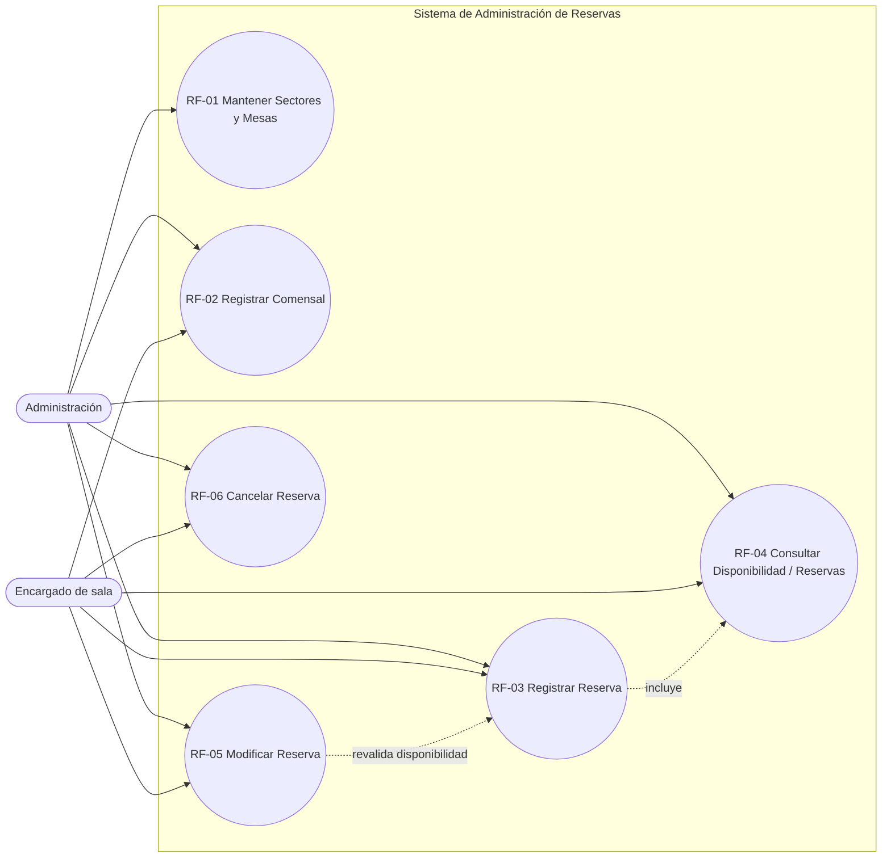

# 3. Diagrama de Casos de Uso (UML)

## Notas de modelado

- **Administración** reúne todas las capacidades de **Encargado de sala**
  (herencia de actor), más `RF-01 Mantener Sectores y Mesas`.
- **RF-03 Registrar Reserva** incluye `RF-04 Consultar Disponibilidad`: no
  se puede confirmar una reserva sin comprobar antes que la mesa esté libre.
- **RF-05 Modificar Reserva** reutiliza la misma validación de traslape que
  `RF-03`, excluyendo la propia reserva del chequeo.
