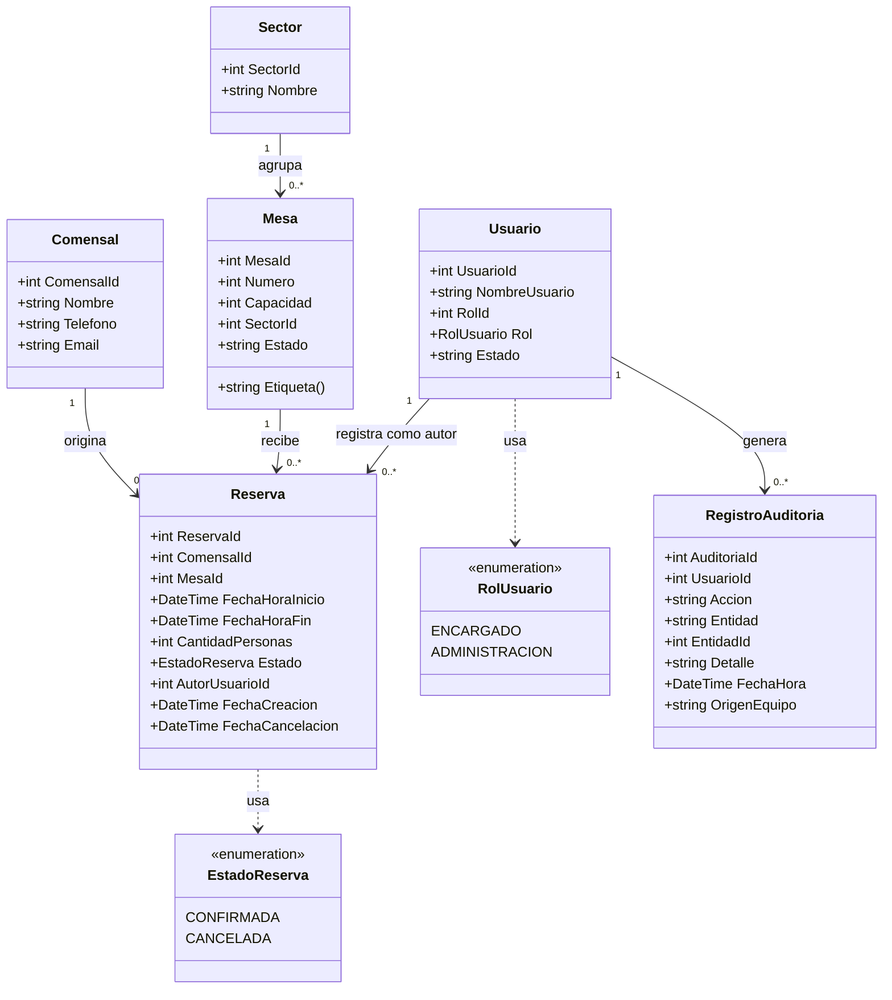

# 4. Diagrama de Clases (UML)

Refleja las entidades reales implementadas en
`src/SistemaReservasRestaurante.Entidades`, alineadas con
`database/schema.sql`.

## Decisiones de diseño reflejadas en el modelo

- **`Sector` como catálogo aparte de `Mesa`**: interior, terraza o salón
  privado se administran en una tabla propia, no como texto libre repetido
  en cada mesa.
- **`Reserva` es N:1 con `Mesa` y N:1 con `Comensal`**: una mesa puede tener
  muchas reservas a lo largo del tiempo (mientras no se traslapen), y un
  comensal puede reservar muchas veces.
- **`EstadoReserva` como enumeración**, no texto libre: el compilador
  impide asignar un estado inválido desde BLL/UI; el `CHECK` en SQL hace lo
  mismo del lado de la base de datos.
- **`FechaHoraInicio` / `FechaHoraFin`** como columnas separadas (en vez de
  una sola fecha + duración) permiten expresar directamente la condición de
  traslape como una comparación de rangos, tanto en C# como en SQL.
