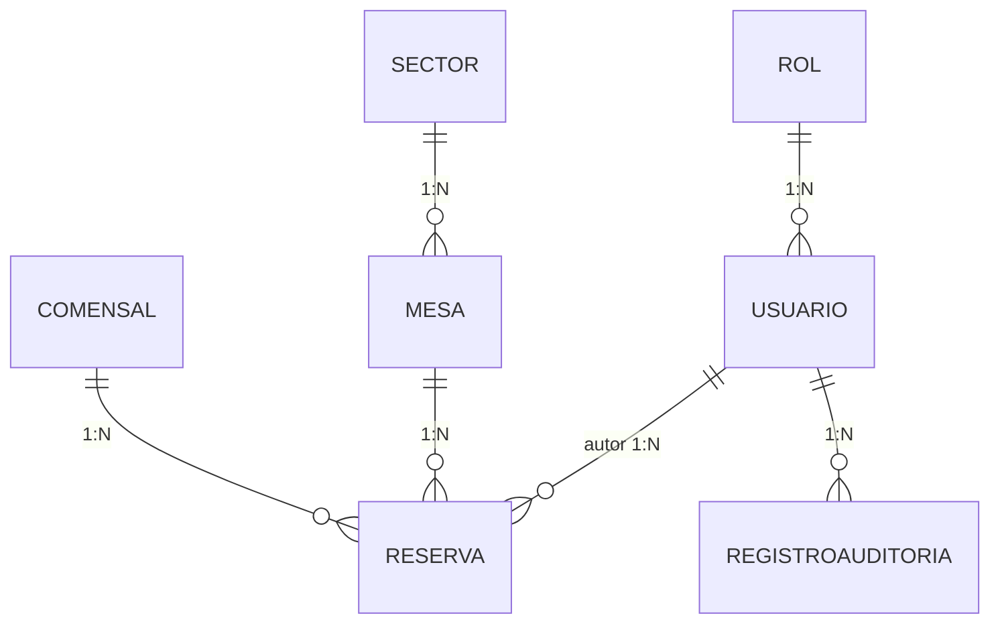

# 5. Modelo Relacional y Normalización

Transformación del diagrama de clases (`04-diagrama-clases.md`) a un diseño
relacional normalizado en SQL Server. Script completo en
`database/schema.sql`.

## Mapa de relaciones



Filiación de datos: un comensal origina reservas; cada reserva se ata a una
mesa; cada mesa desciende de un sector. Se lee de arriba hacia abajo: de
quien reserva a dónde queda finalmente ubicada la reserva.

## Normalización aplicada

### 1FN (Primera Forma Normal)
Todas las columnas son atómicas y no hay grupos repetidos. `Comensal.Nombre`
y `Comensal.Telefono` son columnas separadas, no un campo de texto libre
combinado.

### 2FN (Segunda Forma Normal)
Todas las tablas usan clave primaria simple (`IDENTITY`), por lo que no
puede existir dependencia parcial respecto a solo una parte de la clave. La
2FN queda satisfecha por diseño.

### 3FN (Tercera Forma Normal) — el caso relevante
Se eliminó la dependencia transitiva `MesaId → SectorId → NombreSector`
creando la tabla **`Sector`** como catálogo:

```sql
Mesa.SectorId → Sector.SectorId
```

Beneficio directo: renombrar "Salón privado" a "Salón VIP" es un único
`UPDATE` en `Sector`, no un `UPDATE` masivo sobre cada fila de `Mesa`. El
mismo razonamiento aplica a `Rol` (catálogo `ENCARGADO` / `ADMINISTRACION`)
en vez de una columna de texto libre en `Usuario`.

## Integridad referencial

| Tabla hija | Columna FK | Tabla padre | Regla |
|------------|-----------|-------------|-------|
| `Mesa` | `SectorId` | `Sector` | Una mesa no puede existir sin sector válido. |
| `Reserva` | `ComensalId` | `Comensal` | Una reserva no puede existir sin comensal. |
| `Reserva` | `MesaId` | `Mesa` | Una reserva no puede existir sin mesa. |
| `Reserva` | `AutorUsuarioId` | `Usuario` | Toda reserva es atribuible al usuario que la registró. |
| `Usuario` | `RolId` | `Rol` | Todo usuario tiene un rol válido del catálogo. |
| `RegistroAuditoria` | `UsuarioId` | `Usuario` | Toda entrada de auditoría es atribuible a un usuario. |

## Restricciones `CHECK`

```sql
Reserva.Estado          IN ('CONFIRMADA','CANCELADA')
Reserva.FechaHoraFin    >  FechaHoraInicio
Reserva.CantidadPersonas > 0
Mesa.Capacidad          > 0
Mesa.Estado             IN ('ACTIVA','INACTIVA')
Usuario.Estado          IN ('ACTIVO','BLOQUEADO')
```

Estas restricciones son la última línea de defensa: incluso si una capa
superior tuviera un error, el motor nunca aceptará una reserva con horario
invertido o una cantidad de personas inválida.

## El principio rector como consulta SQL

El criterio de traslape (dos rangos de horario se cruzan si uno empieza
antes de que el otro termine, y termina después de que el otro empieza) se
implementa igual en `ReservaBLL.RevalidarDisponibilidad` y en
`sp_Reserva_Insertar` / `sp_Reserva_Actualizar`:

```sql
WHERE MesaId = @MesaId
  AND Estado = 'CONFIRMADA'
  AND @FechaHoraInicio < FechaHoraFin
  AND @FechaHoraFin > FechaHoraInicio
```

## Baja lógica, nunca `DELETE` físico

Ningún procedimiento almacenado del dominio expone un borrado físico.
`sp_Reserva_Cancelar` únicamente actualiza `Estado` a `'CANCELADA'` y
registra `FechaCancelacion`. `sp_Mesa_Anular` hace lo mismo con `Mesa`.
