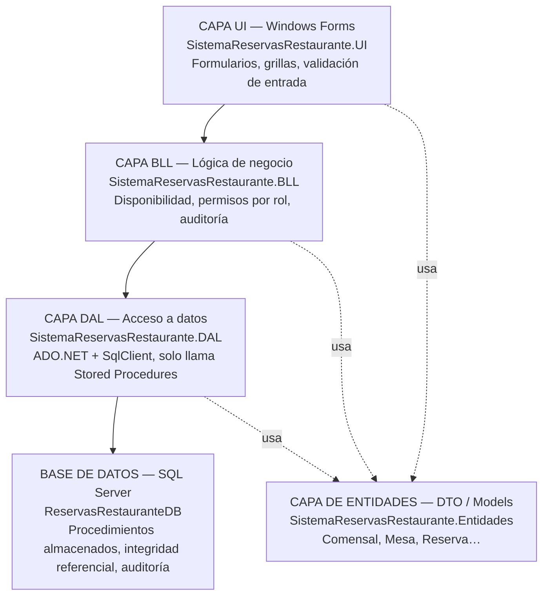

# 6. Arquitectura en 4 Capas



## Responsabilidad de cada capa

| Capa | Proyecto | Responsabilidad | Lo que NO hace |
|------|----------|------------------|-----------------|
| **UI** | `SistemaReservasRestaurante.UI` | Formularios WinForms, captura y despliegue de datos, filtro por fecha antes de ofrecer una mesa. | No abre conexiones a BD, no valida disponibilidad por sí misma. |
| **BLL** | `SistemaReservasRestaurante.BLL` | Permisos por rol (`SesionActual`), validación de campos, revalidación local del traslape de horarios, disparo de auditoría. | No conoce SQL ni cadenas de conexión; solo invoca al DAL. |
| **Entidades** | `SistemaReservasRestaurante.Entidades` | DTOs compartidos por las tres capas (`Comensal`, `Mesa`, `Reserva`, etc.) y enumeraciones (`EstadoReserva`, `RolUsuario`). Atraviesa las cuatro capas sin pertenecer a ninguna. | No tiene lógica ni dependencias hacia las otras capas. |
| **DAL** | `SistemaReservasRestaurante.DAL` | Abre la conexión (`ConexionDb`), ejecuta exclusivamente Stored Procedures con parámetros tipados, traduce `SqlException` a `DalException`. | No decide reglas de negocio ni permisos. |
| **Base de datos** | `ReservasRestauranteDB` (SQL Server) | Procedimientos almacenados, integridad referencial, `CHECK` constraints, última defensa del principio de no-traslape. | No se accede nunca con SQL dinámico desde C#. |

## Flujo de dependencias (referencias de proyecto)

```
SistemaReservasRestaurante.UI  ──depende de──▶ SistemaReservasRestaurante.BLL
SistemaReservasRestaurante.BLL ──depende de──▶ SistemaReservasRestaurante.DAL
SistemaReservasRestaurante.BLL ──depende de──▶ SistemaReservasRestaurante.Entidades
SistemaReservasRestaurante.DAL ──depende de──▶ SistemaReservasRestaurante.Entidades
SistemaReservasRestaurante.UI  ──depende de──▶ SistemaReservasRestaurante.Entidades
```

La UI **nunca** referencia el DAL directamente: todo pasa por la BLL, que es
donde viven los permisos por rol y la revalidación de disponibilidad.

## Ejemplo de flujo completo: registrar una reserva

1. **UI** (`FrmReservas.BtnGuardar_Click`) construye un `Reserva` con los
   datos del formulario y llama a `ReservaBLL.Registrar(reserva)`.
2. **BLL** (`ReservaBLL.Registrar`) exige sesión activa, valida campos,
   valida capacidad de la mesa, revalida localmente que no exista traslape
   (`RevalidarDisponibilidad`), y solo entonces invoca `ReservaDAL.Insertar`.
3. **DAL** (`ReservaDAL.Insertar`) ejecuta `sp_Reserva_Insertar` con los
   parámetros tipados.
4. **Base de datos** (`sp_Reserva_Insertar`) vuelve a comprobar el traslape
   con una consulta sobre `Reserva` filtrada por `MesaId` y `Estado =
   'CONFIRMADA'`; si hay cruce, lanza `RAISERROR` y ninguna fila se inserta.
5. Si el `RAISERROR` ocurre, se propaga como `SqlException` → `DalException`
   → `BllException`; la BLL además registra el intento bloqueado en
   `RegistroAuditoria`, y la UI muestra el mensaje de negocio en un
   `MessageBox`, nunca una traza técnica cruda.
